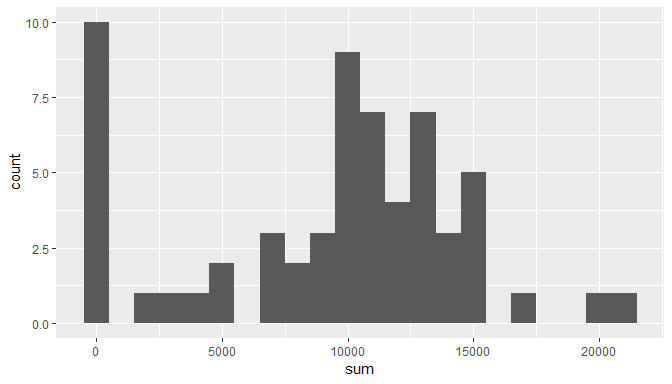
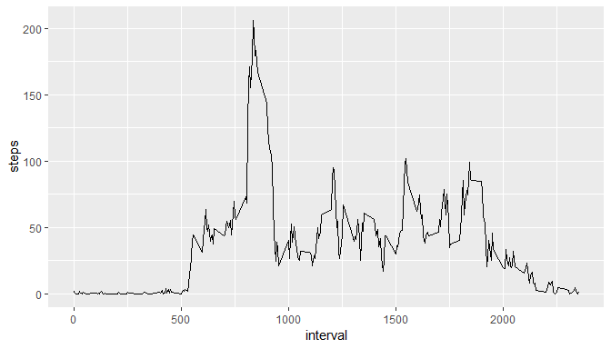
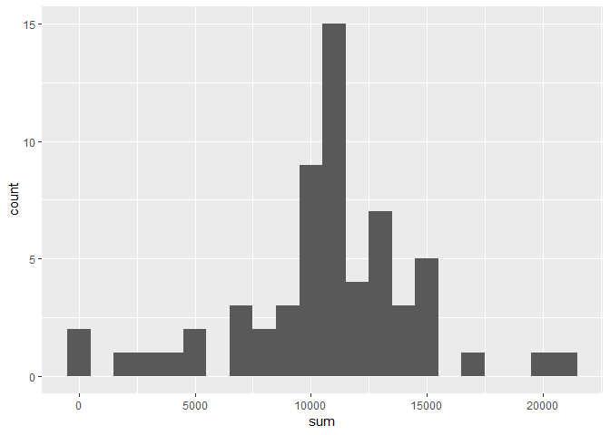
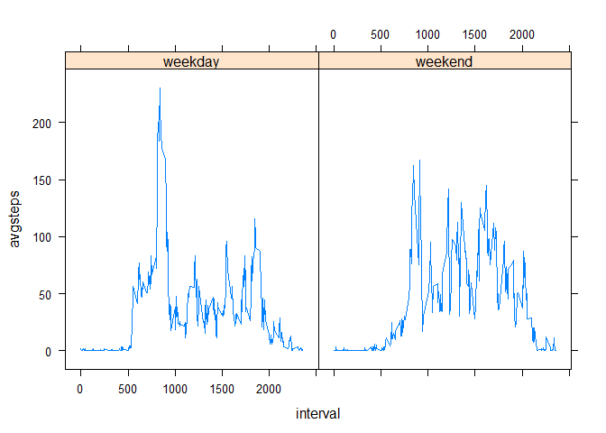

## Loading and preprocessing the data
Here we load the data using *read.csv*.

```r
data<- read.csv("./activity.csv",header = TRUE)
str(data)
```

```
## 'data.frame':	17568 obs. of  3 variables:
##  $ steps   : int  NA NA NA NA NA NA NA NA NA NA ...
##  $ date    : Factor w/ 61 levels "2012-10-01","2012-10-02",..: 1 1 1 1 1 1 1 1 1 1 ...
##  $ interval: int  0 5 10 15 20 25 30 35 40 45 ...
```
As we see the date is a factor variable there is no need to change it to a date format for now. Thus we have not done any preprocessing as of now.


## What is mean total number of steps taken per day?

```r
library(dplyr)
```

```
## Warning: package 'dplyr' was built under R version 3.5.2
```

```
## 
## Attaching package: 'dplyr'
```

```
## The following objects are masked from 'package:stats':
## 
##     filter, lag
```

```
## The following objects are masked from 'package:base':
## 
##     intersect, setdiff, setequal, union
```

```r
library(ggplot2)
```

```
## Warning: package 'ggplot2' was built under R version 3.5.2
```

```r
library(lattice)
```


```r
data<-group_by(data,date)
tot_steps<-summarise(data,sum = sum(steps,na.rm = TRUE))
ggplot(tot_steps, aes(sum))+geom_histogram(binwidth = 1000)
```

<!-- -->

```r
s1<-summary(tot_steps$sum)
s1
```

```
##    Min. 1st Qu.  Median    Mean 3rd Qu.    Max. 
##       0    6778   10395    9354   12811   21194
```
We first load the required packages. Then group the data by date to be able to find sum of steps for each day. We then plot a *histogram* for the number of steps taken per day.  
We then use the function *summary*. The *summary* function gives use the basic 5 number summary of the data along with the mean.

## What is the average daily activity pattern?

```r
t<-with(data, tapply(steps,interval,mean,na.rm=T))
qplot(as.numeric(names(t)),t,geom = "line")+xlab("interval")+ylab("steps")
```

<!-- -->

```r
max<-names(t[which.max(t)])
```
Here we first used tapply to find the average value of steps taken in each time interval over all the days.  
We plot the result.  
We then find the interval for the maximum average steps.  
**The interval having the maximum average steps is 835**

## Imputing missing values

```r
nrw<-sum(is.na(data$steps))
step<-data$steps
for(i in 1:17568){
  if(is.na(step[i])){
    step[i]<-t[as.character(data[i,3])]
  }
}
data_new<-data
data_new$steps<-step
data_new<-group_by(data_new,date)
tot_steps_new<-summarise(data_new,sum = sum(steps,na.rm = TRUE))
ggplot(tot_steps_new, aes(sum))+geom_histogram(binwidth = 1000)
```

<!-- -->

```r
s2<-summary(tot_steps_new$sum)
s2
```

```
##    Min. 1st Qu.  Median    Mean 3rd Qu.    Max. 
##      41    9819   10766   10766   12811   21194
```

```r
meandiff<-as.numeric(s2[4])-as.numeric(s1[4])
medndiff<-as.numeric(s2[3])-as.numeric(s1[3])
```
The number of rows containing missing values are 2304.  
To impute the missing values we use the mean of each time interval as entire days are missing so using the mean of days would be meaningless.
We use a *for loop* to do this. We save the new values of steps in a variable called *steps*.  
We then repeat the code as done in the code chunk *steps* to plot histogram and the 5 number summary plus mean.  
We can see that the histogram has changed and the mean and median of total steps per day has increased by 1411.959171 and 371.1886792 respectively.

## Are there differences in activity patterns between weekdays and weekends?

```r
weekend<-weekdays(as.Date(as.character(data_new$date),"%Y-%m-%d"))
for(i in 1:17568){
  if(weekend[i]=="Sunday"){
    weekend[i]<-"weekend"
  }
  else if(weekend[i] =="Saturday"){
    weekend[i]<-"weekend"
  }
  else{ weekend[i]<-"weekday"}
}
data_new$weekend<-weekend
d1<-subset(data_new,weekend == "weekday")
d2<-subset(data_new,weekend == "weekend")
t1<-tapply(d1$steps,d1$interval,mean)
t2<-tapply(d2$steps,d2$interval,mean)
df1<-data.frame(avgsteps = t1,interval = as.numeric(names(t1)),
                weekend = rep("weekday",288))
df2<-data.frame(avgsteps = t2,interval = as.numeric(names(t2)),
                weekend = rep("weekend",288))
df<-rbind(df1,df2)
xyplot( avgsteps~interval|weekend, df, type = "l")
```

<!-- -->
    
Here we have first created a variable which is "weekend" for the dates corresponding to weekends and "weekday" for dates corresponding to weekdays.   
We then add that variable to our dataset.   
We then subset our dataset accordingly and find the average value of steps for weekends and weekdays respectively.   
We then add these back to another dataset to be easily plotted using lattice plots function *xyplot*.    
We can see that during weedays avg steps are more during the intial day time and lesser at night whereas it is comparatively lower during the day for weekends and comparitively higher during the evening and night time, which makes sense considering how and average person spends his day during weekends and weekdays.    
